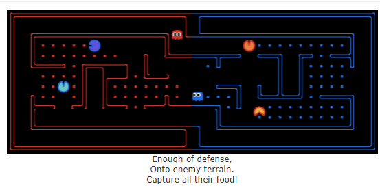

# Pacman-contest-capture-the-flag
source code for Pacman contest: capture the flag to be holded in EASH growth week

http://ai.berkeley.edu/contest.html

## how to code
please see all code in /teams

and you can create your own agents symmetrically

## how to run
Python: 3.6+
script path: pacman-contest\capture.py  
Parameters: --delay 0.0 -r teams/random/myTeam.py -b teams/baseline/myTeam.py

### other useful parameters
you can specify the agent each with different AI strategy

e.g.: 
- --blueOpts=first=DefensiveReflexAgent,second=DefensiveReflexAgent  
- --redOpts=first=DefensiveReflexAgent,second=DefensiveReflexAgent
